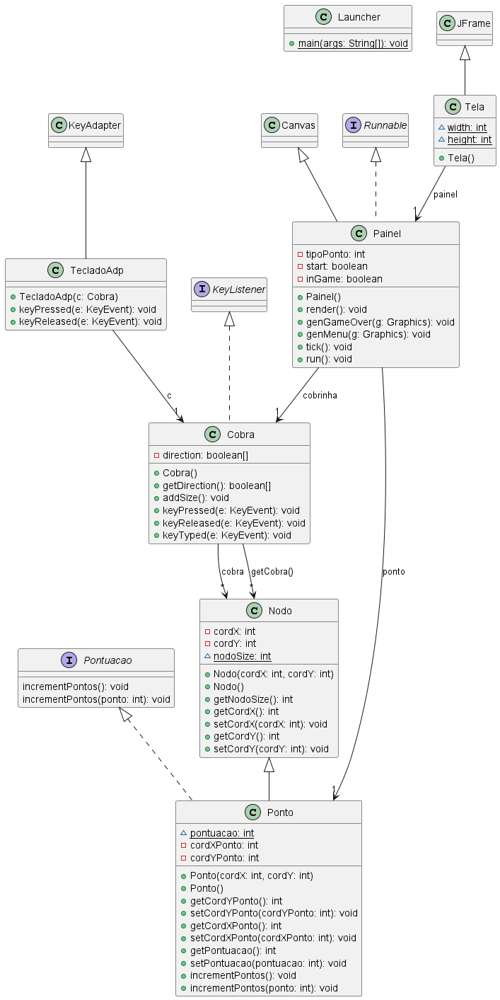

# **Jogo da Cobrinha**

Este é um iconico jogo que com certeza todos conhecemos e marcou a infancia de muitas pessoas. Fiz este joguinho com o objetivo de praticar P.O.O(Programação Orientada a Objeto). O objetivo do jogo é controlar a cobrinha em uma tela e comer maçãs/pontos para aumentar sua ponutação.

## **Funcionalidades**

- Tela do Jogo:
A tela do jogo é onde toda a ação acontece. Ela será criada com uma interface gráfica, apresentando uma grade ou campo onde a cobrinha irá se mover. Nessa tela, serão desenhados todos os elementos do jogo, como a cobrinha, os pontos e a pontuação atual.

- Marcação de Pontuação:
O jogo deve manter um contador de pontuação para acompanhar o desempenho do jogador. Cada vez que a cobrinha comer um ponto, a pontuação aumentará. A pontuação será exibida na tela do jogo para que o jogador possa acompanhá-la durante a partida.

- Colisão com os limites da janela e tela de game over:
Essa funcionalidade trata do comportamento da cobrinha ao colidir com os limites da janela do jogo. Quando a cobrinha atinge as bordas da janela, isso deve ser detectado pelo sistema e o jogo deve ser interrompido. Nesse momento, uma tela de game over deve ser exibida, indicando que o jogador perdeu o jogo.

- Geração de 3 tipos de pontos:
Para aumentar a variedade do jogo, serão gerados três tipos de pontos diferentes que darão pontuações distintas ao jogador. Cada tipo de ponto é representado por uma cor diferente. Por exemplo, um ponto laranja pode valer 1 ponto, um ponto azul pode valer 3 pontos e um ponto amarelo pode valer 4 pontos. Inicialmente, serão gerados apenas pontos verdes. Ao atingir 10 pontos, serão gerados pontos azuis e, ao atingir 20 pontos, serão gerados pontos amarelos. 

## **Diagrama de classes**

